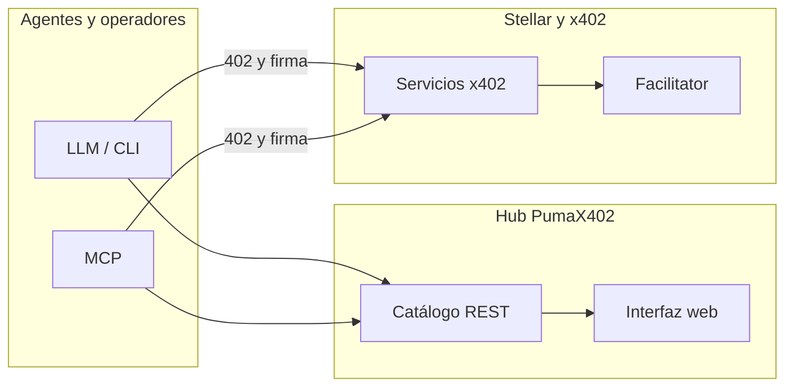

# PumaX402

<p align="center">
  <a href="https://agenticx402-production.up.railway.app/"></a>
  <a href="https://github.com/MarxMad/Agenticx402"></a>
  
  
</p>

**Catálogo y punto de acceso unificado para servicios [x402](https://www.x402.org/) en [Stellar](https://stellar.org):** descubrimiento, pago por petición y consumo con el mismo flujo HTTP 402 → firma → reintento, orientado a agentes y equipos humanos.

| | |
| :--- | :--- |
| **Hub público** | [**agenticx402-production.up.railway.app**](https://agenticx402-production.up.railway.app/) |
| **API del catálogo** | `GET` [`/services`](https://agenticx402-production.up.railway.app/services) · `GET /services/:id` · [`/health`](https://agenticx402-production.up.railway.app/health) |
| **Código** | [github.com/MarxMad/Agenticx402](https://github.com/MarxMad/Agenticx402) |
| **Catálogo remoto (CLI)** | `AGENTICX402_CATALOG_URL=https://agenticx402-production.up.railway.app/services` |

---

## Visión

> Un directorio operativo de microservicios x402 en Stellar y una puerta de entrada para invocarlos con un contrato único: *pago por petición, sin integraciones ad hoc por proveedor*.

---

## Qué incluye el repositorio

| Capa | Contenido |
|------|-----------|
| **Hub** | API REST + interfaz web (`apps/catalog-api`, `apps/catalog-web`): listado, filtros, documentación enlazada. |
| **CLI** | Cliente `agenticx402`: `doctor`, `list`, `fetch`, `call` con x402 Stellar — [`docs/cli.md`](./docs/cli.md) |
| **MCP** | Servidor stdio: `list_services`, `call_service` — [`docs/mcp.md`](./docs/mcp.md) · [`docs/mcp-demo.md`](./docs/mcp-demo.md) |
| **Servicios de referencia** | Agent Pulse, señales DEX (Horizon), riesgo geopolítico (orquestación x402). |
| **Operaciones** | [`Dockerfile`](./Dockerfile) · [`docs/deploy.md`](./docs/deploy.md) |

---

## Arquitectura



El catálogo **no** sustituye al facilitator: publica metadatos y enlaces; cada servicio implementa x402 según la [guía Stellar](https://developers.stellar.org/docs/build/agentic-payments/x402/quickstart-guide).

---

## Inicio rápido

```bash
git clone https://github.com/MarxMad/Agenticx402.git
cd Agenticx402
npm install
npm run cli -- doctor
```

| Objetivo | Comando |
|----------|---------|
| Hub local (API + UI, puerto **3840** por defecto) | `npm run catalog:dev` |
| Listar servicios (catálogo del repo) | `npm run cli -- list` |
| Listar contra el hub público | `AGENTICX402_CATALOG_URL=https://agenticx402-production.up.railway.app/services npm run cli -- list` |
| Servidor MCP | `npm run mcp` |

Variables y claves: [`.env.example`](./.env.example). Pagos en testnet: guía de trustline USDC [`docs/agents-stellar-trustline.md`](./docs/agents-stellar-trustline.md).

---

## API del hub (local o desplegado)

| Ruta | Descripción |
|------|-------------|
| `GET /` | Interfaz del hub |
| `GET /services` | JSON del catálogo |
| `GET /services/:id` | Un servicio |
| `GET /health` | Estado del proceso |

Datos fuente: [`catalog/services.json`](./catalog/services.json). Validación antes de contribuir: `npm run catalog:validate`. Registro de altas: [`catalog/README.md`](./catalog/README.md).

---

## Servicios en catálogo (referencia)

| Servicio | Rol |
|----------|-----|
| **Agent Pulse** (`pumax402-agent-pulse`) | Contexto de red para prompts de agentes tras pago x402 (USDC testnet). [`apps/puma-service/README.md`](./apps/puma-service/README.md) |
| **DEX Signal** (`pumax402-stellar-dex-signal`) | Señales Horizon (libro, trades, pools). [`apps/stellar-dex-signal/README.md`](./apps/stellar-dex-signal/README.md) |
| **Geopolitical Risk** (`pumax402-geopolitical-risk`) | Agregación de riesgo con upstream x402. [`apps/geopolitical-risk/README.md`](./apps/geopolitical-risk/README.md) |

Ejemplo local Agent Pulse (dos terminales):

```bash
export PUMA_X402_PAYTO=G...   # cuenta receptora con trustline USDC testnet
npm run puma-service

export STELLAR_SECRET_KEY=S...   # pagador
npm run cli -- fetch "http://127.0.0.1:3850/v1/pulse"
```

Otros servicios: `npm run dex-signal` · `npm run geopolitical-risk` — rutas y precios en cada README y en el JSON del catálogo.

---

## CLI — comandos frecuentes

**Invocación:** `npm run cli -- <comando>` (el `--` separa argumentos de npm de los del CLI).

| Comando | Uso |
|---------|-----|
| `doctor` | Comprueba Node, entorno, catálogo y recordatorios Stellar. |
| `list` | Lista servicios del catálogo. |
| `fetch "<url>"` | Petición HTTP; ante 402, firma y reintenta si hay `STELLAR_SECRET_KEY`. |
| `call <id> --path /ruta` | Resuelve `baseUrl` desde el catálogo y aplica el mismo flujo x402. |
| `splash` / `splash --animate` | Identidad en terminal. |

Referencias: [`docs/cli.md`](./docs/cli.md) · bin enlazable `agenticx402` tras `npm link`.

---

## Documentación

| Documento | Tema |
|-----------|------|
| [`docs/PROGRESS.md`](./docs/PROGRESS.md) | Estado del proyecto y bitácora |
| [`docs/setup-fase-0.md`](./docs/setup-fase-0.md) | Entorno Stellar / wallet testnet |
| [`docs/deploy.md`](./docs/deploy.md) | Despliegue del hub |
| [`docs/hackathon-jurado.md`](./docs/hackathon-jurado.md) | Pitch, mensajes clave Stellar/x402 y guion audiovisual |
| [`docs/x402-stellar-panorama.md`](./docs/x402-stellar-panorama.md) | Panorama del ecosistema |
| [`docs/docs.md`](./docs/docs.md) | Enlaces Stellar, x402, MCP |
| [`CONTRIBUTING.md`](./CONTRIBUTING.md) | Contribución |
| [`BUSINESS_MODEL.md`](./BUSINESS_MODEL.md) | Modelo de negocio |

Checklist local: `npm run fase0:check`. Hub con Docker:

```bash
docker build -t pumax402-hub .
docker run --rm -p 8080:8080 -e PORT=8080 pumax402-hub
```

Abrir `http://127.0.0.1:8080/` y `/health`.

---

## Stack

| Área | Tecnología |
|------|------------|
| Runtime | Node.js 20+ |
| Pagos agentic | [`@x402/core`](https://www.npmjs.com/package/@x402/core), [`@x402/stellar`](https://www.npmjs.com/package/@x402/stellar) |
| Agente | MCP [`@modelcontextprotocol/sdk`](https://www.npmjs.com/package/@modelcontextprotocol/sdk) |
| Red | Stellar (testnet por defecto en ejemplos); facilitator según [documentación](https://developers.stellar.org/docs/build/agentic-payments/x402/built-on-stellar) |
| Catálogo | JSON versionado (`catalog/services.json`) |

---

## Licencia

[MIT](./LICENSE)

---

*PumaX402 — hub de servicios x402 para el ecosistema agentic en Stellar.* Issues y pull requests: [MarxMad/Agenticx402](https://github.com/MarxMad/Agenticx402).
