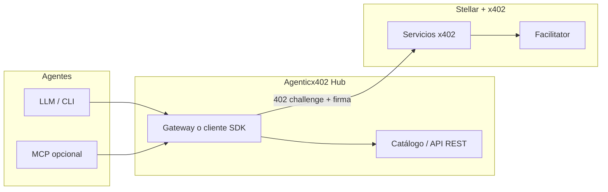

# Agenticx402

**Hub de servicios pagados por petición para agentes de IA — construido sobre [Stellar](https://stellar.org) y [x402](https://www.x402.org/).**

Repositorio oficial: **[github.com/MarxMad/Agenticx402](https://github.com/MarxMad/Agenticx402)**

---

## Por qué existe esto

Los agentes necesitan **descubrir**, **pagar** y **consumir** APIs de forma uniforme. x402 estandariza el flujo HTTP 402 → firma → pago; Stellar lo ejecuta con bajas fricciones y USDC/XLM en testnet o mainnet. Este proyecto apunta a ser el **punto de encuentro**: catálogo + acceso unificado para humanos y para agentes (HTTP, SDK y opcionalmente MCP).

## Visión en una frase

> Un directorio vivo de microservicios x402 en Stellar y una puerta de entrada para que cualquier agente los invoque con el mismo contrato mental: *pay-per-request, sin cuentas opacas ni integraciones ad hoc por proveedor*.

## Objetivos del MVP (hackathon)

| Meta | Descripción |
|------|-------------|
| **Catálogo** | Listado de servicios con metadata: URL base, precio, asset, red (`stellar:testnet`), tags, estado. |
| **Cliente unificado** | Librería o CLI que ejecute el flujo x402 completo contra cualquier URL registrada. |
| **Demostración** | Al menos 2–3 servicios de ejemplo (o integración con servicios públicos de prueba) y un video o guía de 5 minutos. |
| **Historia “agent-first”** | Documentar el flujo desde un LLM (ej. vía MCP o instrucciones reproducibles). |

## Arquitectura objetivo



- **Catálogo**: no sustituye al facilitator; solo **enruta metadata** y opcionalmente health checks.
- **Servicios**: cada uno es un servidor x402 estándar ([quickstart Stellar](https://developers.stellar.org/docs/build/agentic-payments/x402/quickstart-guide)).

## Plan de implementación

### Fase 0 — Aterrizaje (0.5–1 día)

- [ ] Fijar alcance: ¿solo testnet? ¿USDC únicamente?
- [ ] Clonar y correr [stellar/x402-stellar](https://github.com/stellar/x402-stellar) + [quickstart](https://developers.stellar.org/docs/build/agentic-payments/x402/quickstart-guide) localmente.
- [ ] Billetera de prueba en [Lab](https://developers.stellar.org/docs/tools/lab) o Freighter; fondos testnet.
- [ ] Probar un servicio existente ([xlm402.com](https://xlm402.com)) para validar el flujo end-to-end.

### Fase 1 — Cimientos del hub (1–2 días)

- [ ] **Modelo de datos** del catálogo: `id`, `name`, `baseUrl`, `price`, `asset`, `network`, `description`, `tags`, `openapiUrl` (opcional).
- [ ] **API read-only** del catálogo (JSON) + página estática o SPA mínima que liste servicios.
- [ ] **Seed** con 1 servicio “dummy” pagado y documentación de cómo alta un servicio nuevo.

### Fase 2 — Cliente x402 reusable (1–2 días)

- [ ] Extraer/reutilizar lógica de pago con [`x402-stellar` (npm)](https://www.npmjs.com/package/x402-stellar) o patrones del monorepo oficial.
- [ ] **CLI o función única**: `agenticx402 call <service-id> --path ...` que resuelva URL desde el catálogo y complete el flujo 402.
- [ ] Tests de integración contra testnet (sin claves en repo; usar env).

### Fase 3 — Cara de agente (1 día)

- [ ] **MCP server** delgado: herramientas `list_services`, `call_service` que usen el cliente de Fase 2 (referencia: [x402-mcp-stellar](https://github.com/jamesbachini/x402-mcp-stellar), [Stellar Observatory](https://github.com/elliotfriend/stellar-observatory)).
- [ ] O alternativa: **skill** / prompt pack con ejemplos copy-paste para Claude Code / Cursor.

### Fase 4 — Pulido para demo (0.5–1 día)

- [ ] README de contribución para **registrar un servicio** en el catálogo (PR o formulario estático).
- [ ] Grabación o GIF del flujo: agente → pago → respuesta.
- [ ] **Deploy** del catálogo + cliente (ej. Vercel, Railway, Fly) — testnet only para el hackathon.

### Post-hackathon (opcional)

- [ ] Soporte mainnet tras revisar límites y compliance.
- [ ] Registro/onboarding de proveedores con verificación mínima.
- [ ] Explorar [MPP](https://developers.stellar.org/docs/build/agentic-payments/mpp) para cargas altas (canales) donde el coste por tx importe.

## Stack sugerido

| Capa | Opciones |
|------|----------|
| Runtime | Node.js 20+ / TypeScript |
| x402 | [coinbase/x402](https://github.com/coinbase/x402), [stellar/x402-stellar](https://github.com/stellar/x402-stellar) |
| Red | Stellar testnet; facilitator según [docs Built on Stellar](https://developers.stellar.org/docs/build/agentic-payments/x402/built-on-stellar) |
| Catálogo | JSON estático al inicio → SQLite/Postgres si crece |

## Recursos que estamos usando

Lista curada en este repo: [`docs.md`](./docs.md) (Stellar, x402, MPP, MCP, wallets compatibles, ejemplos de la comunidad).

## Cómo clonar y enlazar con GitHub

```bash
git clone https://github.com/MarxMad/Agenticx402.git
cd Agenticx402
```

Si trabajas en una copia local con otro nombre de carpeta, añade el remoto:

```bash
git remote add origin https://github.com/MarxMad/Agenticx402.git
git branch -M main
git push -u origin main
```

## Estado del repositorio

> El remoto puede estar vacío al inicio; este README define **north star** y **checklist** para la primera ola de commits.

## Licencia

Por definir (MIT recomendada para hackathon y reuso de ejemplos con atribución a Stellar/x402).

---

**Construido para el ecosistema agentic + Stellar.** PRs y issues bienvenidos en [MarxMad/Agenticx402](https://github.com/MarxMad/Agenticx402).
