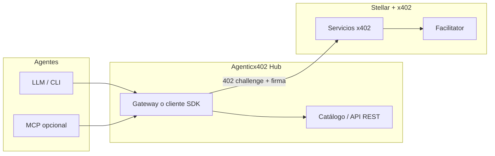

# Agenticx402

**Hub de servicios pagados por petición para agentes de IA — construido sobre [Stellar](https://stellar.org) y [x402](https://www.x402.org/).**

Repositorio oficial: **[github.com/MarxMad/Agenticx402](https://github.com/MarxMad/Agenticx402)**

---

## Por qué existe esto

Los agentes necesitan **descubrir**, **pagar** y **consumir** APIs de forma uniforme. x402 estandariza el flujo HTTP 402 → firma → pago; Stellar lo ejecuta con bajas fricciones y USDC/XLM en testnet o mainnet. Este proyecto apunta a ser el **punto de encuentro**: catálogo + acceso unificado para humanos y para agentes (HTTP, SDK y opcionalmente MCP).

## Visión en una frase

> Un directorio vivo de microservicios x402 en Stellar y una puerta de entrada para que cualquier agente los invoque con el mismo contrato mental: *pay-per-request, sin cuentas opacas ni integraciones ad hoc por proveedor*.

## Objetivos del MVP (hackathon)

| Meta | Descripción |
|------|-------------|
| **Catálogo** | Listado de servicios con metadata: URL base, precio, asset, red (`stellar:testnet`), tags, estado. |
| **Cliente unificado** | Librería o CLI que ejecute el flujo x402 completo contra cualquier URL registrada. |
| **Demostración** | Al menos 2–3 servicios de ejemplo (o integración con servicios públicos de prueba) y un video o guía de 5 minutos. |
| **Historia “agent-first”** | Documentar el flujo desde un LLM (ej. vía MCP o instrucciones reproducibles). |

## Arquitectura objetivo



- **Catálogo**: no sustituye al facilitator; solo **enruta metadata** y opcionalmente health checks.
- **Servicios**: cada uno es un servidor x402 estándar ([quickstart Stellar](https://developers.stellar.org/docs/build/agentic-payments/x402/quickstart-guide)).

## Plan de implementación

Orden **secuencial**: cada fase cierra con *criterios de hecho* verificables.

- **Avance y tareas para el equipo:** [`docs/PROGRESS.md`](./docs/PROGRESS.md) (actualizar al cerrar trabajo).
- **Cómo contribuir:** [`CONTRIBUTING.md`](./CONTRIBUTING.md).
- **Fase 0 (checklist local):** [`docs/setup-fase-0.md`](./docs/setup-fase-0.md).
- **Modelo de negocio:** [`BUSINESS_MODEL.md`](./BUSINESS_MODEL.md).

### Fase 0 — Aterrizaje (0.5–1 día)

**Objetivo:** mismo lenguaje técnico que el jurado (402, facilitator, firma); wallet testnet lista; un flujo real completado.

| Tarea | Detalle |
|-------|---------|
| Alcance | Por defecto: **solo testnet**; activo principal **USDC** donde aplique; XLM si el ejemplo lo requiere. |
| x402-stellar / quickstart | Clonar [stellar/x402-stellar](https://github.com/stellar/x402-stellar) en carpeta hermana; seguir [quickstart](https://developers.stellar.org/docs/build/agentic-payments/x402/quickstart-guide) hasta respuesta exitosa tras pago. |
| Wallet | [Lab](https://developers.stellar.org/docs/tools/lab) o Freighter (desktop); fondos testnet; **no** subir claves al repo. |
| Servicio externo | Probar al menos un flujo contra [xlm402.com](https://xlm402.com) (o otro endpoint público documentado). |

**Criterios de hecho:** (1) nota interna o issue con endpoint probado y red; (2) screenshot o log de éxito **sin secretos**; (3) `.env` local ignorado por git.

**Artefacto en repo:** guía [`docs/setup-fase-0.md`](./docs/setup-fase-0.md) + este README actualizado.

### Fase 1 — Cimientos del hub (1–2 días)

**Objetivo:** el catálogo es **dato versionado** + **API** consumible; cualquier agente puede *descubrir* servicios sin conocer URLs sueltas.

| Tarea | Detalle |
|-------|---------|
| Modelo de datos | Campos mínimos por servicio: `id`, `name`, `baseUrl`, `description`, `tags`, `status`, `network` (o `networkDefault` global), `source`; opcion `paths[]`, `pricingNote` o objeto `price`, `docsUrl`, `openapiUrl`. Ver semilla en [`catalog/services.json`](./catalog/services.json). |
| API read-only | `GET /services`, `GET /services/:id` — [`apps/catalog-api/server.mjs`](./apps/catalog-api/server.mjs). |
| UI mínima | **Hecha:** [`apps/catalog-web/index.html`](./apps/catalog-web/index.html) — lista, filtro por texto, filtro por tag, enlaces a sitio/docs/JSON. Sirve en `GET /` con `npm run catalog:dev`. |
| Alta de servicios | [`catalog/README.md`](./catalog/README.md) + validación **`npm run catalog:validate`** ([`scripts/validate-catalog.mjs`](./scripts/validate-catalog.mjs)). |

**Criterios de hecho:** ✅ API alineada con `catalog/services.json`; ✅ UI usable en `/`; ✅ alta documentada y validable en CI/local.

**Estado:** Fase 1 **cerrada en repo**.

### Fase 2 — Cliente x402 reusable (1–2 días)

**Objetivo:** una sola herramienta ejecuta **402 → pago → retry** contra cualquier URL (y URLs armadas desde el catálogo).

| Tarea | Detalle |
|-------|---------|
| Dependencias | [`@x402/core`](https://www.npmjs.com/package/@x402/core) + [`@x402/stellar`](https://www.npmjs.com/package/@x402/stellar) (esquema Exact + `x402Client` / `x402HTTPClient`). |
| CLI | **`npm run cli`** → binario [`apps/cli/bin/agenticx402.mjs`](./apps/cli/bin/agenticx402.mjs): `list`, `fetch <url>`, `call <service-id> --path /ruta`. Código reusable en [`apps/cli/lib/x402-fetch.mjs`](./apps/cli/lib/x402-fetch.mjs). |
| Config | [`.env.example`](./.env.example); `STELLAR_SECRET_KEY` solo por entorno (sin clave, `fetch`/`call` hacen un intento; si hay 402, indica que falta la clave). |
| Pruebas | Sin claves en CI: `npm run cli -- list` y `fetch` a URL pública; pago real: manual con testnet — ver [`docs/cli.md`](./docs/cli.md). |

**Criterios de hecho:** ✅ CLI documentado; ✅ flujo 402 implementado con reintento; ⏳ validación con endpoint testnet real la hace cada dev con su wallet.

**Estado:** Fase 2 **implementada en repo** — falta comprobar contra un **402 real** con fondos testnet (Fase 0).

### Fase 3 — Cara de agente (1 día)

**Objetivo:** demostrar consumo desde un **agente** (MCP o skill), no solo desde terminal humana.

| Tarea | Detalle |
|-------|---------|
| MCP | Servidor delgado: tools `list_services` (lee API/catálogo) y `call_service` (delega en CLI o librería de Fase 2). Referencias: [x402-mcp-stellar](https://github.com/jamesbachini/x402-mcp-stellar), [Stellar Observatory](https://github.com/elliotfriend/stellar-observatory). |
| Alternativa | Skill Markdown + prompts reproducibles en Cursor/Claude Code si el tiempo apremia. |

**Criterios de hecho:** un flujo grabado o script donde el LLM elige un servicio del catálogo y obtiene respuesta pagada.

### Fase 4 — Pulido para demo (0.5–1 día)

**Objetivo:** entrega presentable al jurado: onboarding claro + deploy + storytelling.

| Tarea | Detalle |
|-------|---------|
| Contribución | Ampliar [`CONTRIBUTING.md`](./CONTRIBUTING.md) si aparecen reglas nuevas (deploy, branches). Base ya lista. |
| Demo | Video corto o GIF: agente → listado → pago → resultado; narrar diferencia vs usar solo xlm402 sin orquestación. |
| Deploy | Catálogo + API + UI en Vercel/Railway/Fly; **testnet only**; variables solo en panel del hosting. |

**Criterios de hecho:** URL pública del hub + enlace al repo; cualquier miembro del equipo puede repetir la demo en máquina limpia siguiendo docs.

### Post-hackathon (opcional)

- [ ] Mainnet tras revisar compliance y límites.
- [ ] Onboarding de proveedores con verificación mínima y analytics (alineado a [BUSINESS_MODEL.md](./BUSINESS_MODEL.md)).
- [ ] [MPP](https://developers.stellar.org/docs/build/agentic-payments/mpp) / canales si el volumen por request lo justifica.

## Stack sugerido

| Capa | Opciones |
|------|----------|
| Runtime | Node.js 20+ / TypeScript |
| x402 | [coinbase/x402](https://github.com/coinbase/x402), [stellar/x402-stellar](https://github.com/stellar/x402-stellar) |
| Red | Stellar testnet; facilitator según [docs Built on Stellar](https://developers.stellar.org/docs/build/agentic-payments/x402/built-on-stellar) |
| Catálogo | JSON estático al inicio → SQLite/Postgres si crece |

## Catálogo (en evolución)

Datos: [`catalog/services.json`](./catalog/services.json). Validar antes de PR: `npm run catalog:validate`.

Con Node 20+: `npm run catalog:dev` (puerto **3840**, o `PORT`).

| Ruta | Uso |
|------|-----|
| `GET /` | Interfaz del hub (listado + filtros) |
| `GET /services` | JSON del catálogo completo |
| `GET /services/:id` | Un servicio |
| `GET /health` | Salud del proceso (JSON) |

### CLI (Fase 2)

```bash
npm run cli -- list
npm run cli -- fetch "https://url-completa"
npm run cli -- call stellar-observatory --path /ruta --method GET
```

Detalle: [`docs/cli.md`](./docs/cli.md). La ayuda (`-h`) y `list` muestran un **medallón** (oro / azul marino, anillos y **x402**, alineado con [`assets/logo.png`](./assets/logo.png)); `AGENTICX402_NO_BANNER=1` lo desactiva.

Catálogo remoto: `AGENTICX402_CATALOG_URL=http://127.0.0.1:3840/services npm run cli -- list`.

## Recursos que estamos usando

Lista curada en este repo: [`docs.md`](./docs.md) (Stellar, x402, MPP, MCP, wallets compatibles, ejemplos de la comunidad).

## Cómo clonar y enlazar con GitHub

```bash
git clone https://github.com/MarxMad/Agenticx402.git
cd Agenticx402
```

Si trabajas en una copia local con otro nombre de carpeta, añade el remoto:

```bash
git remote add origin https://github.com/MarxMad/Agenticx402.git
git branch -M main
git push -u origin main
```

## Estado del repositorio

**Fases 1 y 2** listas en repo (hub + CLI x402). **Fase 0** sigue siendo obligatoria **por desarrollador** para probar pagos reales — ver [`docs/PROGRESS.md`](./docs/PROGRESS.md). Siguiente hito: **Fase 3** (MCP).

## Licencia

Por definir (MIT recomendada para hackathon y reuso de ejemplos con atribución a Stellar/x402).

---

**Construido para el ecosistema agentic + Stellar.** PRs y issues bienvenidos en [MarxMad/Agenticx402](https://github.com/MarxMad/Agenticx402).
