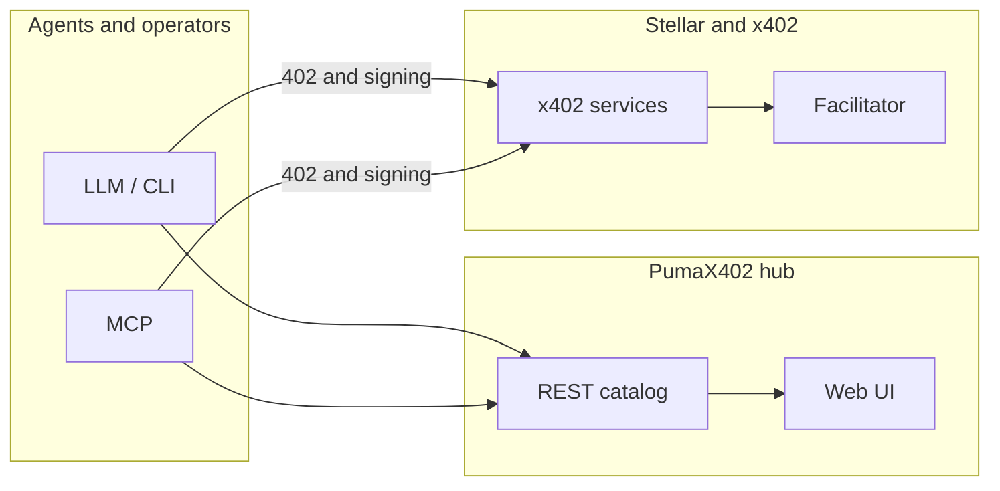

# PumaX402

<p align="center">
  <a href="https://agenticx402-production.up.railway.app/"></a>
  <a href="https://github.com/MarxMad/Agenticx402"></a>
  
  
</p>

**A unified catalog and access layer for [x402](https://www.x402.org/) services on [Stellar](https://stellar.org):** discover, pay per request, and consume APIs with the same HTTP 402 → sign → retry flow—for agents and human operators alike.

**Straight talk:** any agent *could* integrate x402 endpoints one by one. PumaX402 is **not** “secret sauce in the protocol.” The protocol is public. What stacks over time is **(a)** first-party APIs with **Stellar-specific and orchestration value**, **(b)** one discovery surface (catalog + MCP/CLI), and **(c)** room to ship **more** team-owned services under the same contract. If you only need one external URL, you do not need us; if you want **our** DEX / risk / pulse semantics and a single way to find and call them, you do.

| | |
| :--- | :--- |
| **Public hub** | [**agenticx402-production.up.railway.app**](https://agenticx402-production.up.railway.app/) |
| **Catalog API** | `GET` [`/services`](https://agenticx402-production.up.railway.app/services) · `GET /services/:id` · [`/health`](https://agenticx402-production.up.railway.app/health) |
| **Source** | [github.com/MarxMad/Agenticx402](https://github.com/MarxMad/Agenticx402) |
| **Remote catalog (CLI)** | `AGENTICX402_CATALOG_URL=https://agenticx402-production.up.railway.app/services` |

---

## Vision

> An operational directory of x402 microservices on Stellar and a single front door to call them with one mental model: *pay per request, without bespoke integrations per provider*.

---

## Novedades del MVP (Últimos Cambios)

El código fundacional ha sido optimizado con mejoras orientadas al marco institucional 2026:
- **Latencia Optimizada (< 500ms):** El servicio `stellar-dex-signal` ahora cuenta con persistencia de orderbooks a memoria RAM mediante Streaming WebSockets puro proveniente de `stellar-sdk` para ofrecer velocidad instantánea.
- **Estándar XGATE 2026:** El `catalog/services.json` ha sido ampliado y validado con los rigurosos esquemas de indexación XGATE (`version`, `cost`, `provider_address`, `discovery_tags`).
- **Middleware de Trustlines Compartido:** Fuerte seguridad con pre-evaluación de las métricas de red. Si el cliente carece de la línea de confianza con los activos aceptados (USDC/EURC), el servidor ataja el error tempranamente enviando instrucciones amigables en `402 Payment Required` (ver Requisitos al final del documento).

---

## First-party APIs (where differentiation lives)

These are **maintained in this repo** (`source: team` in the catalog). They are the core “why us” beyond a generic directory: **shaped responses, Stellar/Horizon semantics, and multi-step x402 orchestration** agents can rely on without reimplementing each flow.

| API | Catalog id | What it gives an agent |
|-----|------------|-------------------------|
| **Stellar DEX Signal** | `pumax402-stellar-dex-signal` | Order-book and trading-relevant structure from **Horizon** (book, trades, pool snapshot)—paid, consistent schema, DEX-focused. [`README`](./apps/stellar-dex-signal/README.md) |
| **Geopolitical Risk** | `pumax402-geopolitical-risk` | **Orchestrated** risk signal (upstream x402 news + aggregation heuristics)—one call instead of wiring payments + merge logic yourself. [`README`](./apps/geopolitical-risk/README.md) |
| **Agent Pulse** | `pumax402-agent-pulse` | **Network context** for prompts (ledger/fees/hints)—cheap orientation for agents on Stellar testnet workflows. [`README`](./apps/puma-service/README.md) |

Additional team-owned capabilities should land the same way: **new service + catalog entry + same MCP/CLI `call`**—so the hub grows with **your** APIs, not only third-party links.

---

## What’s in this repo (platform + catalog)

| Layer | Contents |
|------|----------|
| **Hub** | REST API + web UI (`apps/catalog-api`, `apps/catalog-web`): listing, filters, linked documentation. |
| **CLI** | `agenticx402` client: `doctor`, `list`, `fetch`, `call` with Stellar x402 — [`docs/cli.md`](./docs/cli.md) |
| **MCP** | Stdio server: `list_services`, `call_service` — [`docs/mcp.md`](./docs/mcp.md) · [`docs/mcp-demo.md`](./docs/mcp-demo.md) |
| **Operations** | [`Dockerfile`](./Dockerfile) · [`docs/deploy.md`](./docs/deploy.md) |

The catalog also lists **ecosystem** entries (e.g. [`catalog/services.json`](./catalog/services.json) `source: external`) for discovery and benchmarking—not claimed as PumaX402 IP.

---

## Product gap (what often feels “missing”)

Open payment rails are **necessary but not sufficient**. Teams that win on top of x402 usually add at least one of: **unique data or models**, **verified provider quality**, **SLAs / support**, **compliance posture**, or **vertical packaging** (one product for traders, risk desks, etc.). PumaX402 today is strong on **shipping first-party x402 APIs + a thin platform**; the next layer of “innovation” is whichever of those you choose to make explicit next.

---

## Architecture



The catalog does **not** replace the facilitator: it publishes metadata and links; each service implements x402 per the [Stellar guide](https://developers.stellar.org/docs/build/agentic-payments/x402/quickstart-guide).

---

## Requisitos para Agentes (Trustlines)

Para garantizar la interoperabilidad en la red Stellar y admitir micro-cobros en $x402$, todos los Agentes (o sus _wallets_ delegadas) deben establecer los siguientes **Trustlines** en la red correspondiente antes de invocar los endpoints que cobren en stablecoins:

### Circle Issuers Oficiales
Se debe realizar una operación `changeTrust` hacia los emisores oficiales de Circle para autorizar el comercio de su activo.
- **USDC (Mainnet)**: `GA5ZSEJYB37JRC52ZMR0UT5PZK7M84K0A7D40QQR6K1823T8H23RFT1`
- **USDC (Testnet)**: `GBBD47IF6LWK7P7MDEVSCWR7DPUWV3NY3DTQEVFL4NAT4AQH3ZLLFLA5`
- **EURC (Mainnet)**: `GCO22MDQA...` *(Refiérase a la documentación oficial de Circle para la ID completa de EURC activo)*

Nuestros servicios `pumax402` implementan un middleware validador. Si la PublicKey del cliente no posee la línea de confianza requerida al momento de la pre-evaluación del cobro, la llamada será abortada con un estatus `402 Payment Required`, incluyendo en su respuesta HTTP un campo `instruction` que le indicará al agente cómo abrir este trustline.

---

## Quick start

```bash
git clone https://github.com/MarxMad/Agenticx402.git
cd Agenticx402
npm install
npm run cli -- doctor
```

| Goal | Command |
|------|---------|
| Local hub (API + UI, default port **3840**) | `npm run catalog:dev` |
| List services (repo catalog) | `npm run cli -- list` |
| List against the public hub | `AGENTICX402_CATALOG_URL=https://agenticx402-production.up.railway.app/services npm run cli -- list` |
| MCP server | `npm run mcp` |

Environment variables and keys: [`.env.example`](./.env.example). Testnet payments: USDC trustline guide [`docs/agents-stellar-trustline.md`](./docs/agents-stellar-trustline.md).

---

## Hub API (local or deployed)

| Route | Description |
|------|-------------|
| `GET /` | Hub web UI |
| `GET /services` | Full catalog JSON |
| `GET /services/:id` | Single service |
| `GET /health` | Process health |

Source data: [`catalog/services.json`](./catalog/services.json). Validate before contributing: `npm run catalog:validate`. How to add entries: [`catalog/README.md`](./catalog/README.md).

---

## First-party quick run (example)

Local Agent Pulse example (two terminals):

```bash
export PUMA_X402_PAYTO=G...   # receive address with USDC testnet trustline
npm run puma-service

export STELLAR_SECRET_KEY=S...   # payer
npm run cli -- fetch "http://127.0.0.1:3850/v1/pulse"
```

Other services: `npm run dex-signal` · `npm run geopolitical-risk` — routes and pricing in each README and in the catalog JSON.

---

## CLI — common commands

**Invocation:** `npm run cli -- <command>` (the `--` separates npm args from CLI args).

| Command | Purpose |
|---------|---------|
| `doctor` | Check Node, environment, catalog, and Stellar reminders. |
| `list` | List catalog services. |
| `fetch "<url>"` | HTTP request; on 402, sign and retry if `STELLAR_SECRET_KEY` is set. |
| `call <id> --path /route` | Resolve `baseUrl` from the catalog and run the same x402 flow. |
| `splash` / `splash --animate` | Terminal branding. |

Details: [`docs/cli.md`](./docs/cli.md) · linkable `agenticx402` binary after `npm link`.

---

## Documentation

| Doc | Topic |
|-----|-------|
| [`docs/PROGRESS.md`](./docs/PROGRESS.md) | Project status and changelog |
| [`docs/setup-fase-0.md`](./docs/setup-fase-0.md) | Stellar environment / testnet wallet |
| [`docs/deploy.md`](./docs/deploy.md) | Hub deployment |
| [`docs/hackathon-jurado.md`](./docs/hackathon-jurado.md) | Pitch, Stellar/x402 messaging, AV script (Spanish) |
| [`docs/x402-stellar-panorama.md`](./docs/x402-stellar-panorama.md) | Ecosystem overview |
| [`docs/docs.md`](./docs/docs.md) | Curated Stellar, x402, MCP links |
| [`CONTRIBUTING.md`](./CONTRIBUTING.md) | Contributing |
| [`BUSINESS_MODEL.md`](./BUSINESS_MODEL.md) | Business model |

Local checklist: `npm run fase0:check`. Hub with Docker:

```bash
docker build -t pumax402-hub .
docker run --rm -p 8080:8080 -e PORT=8080 pumax402-hub
```

Open `http://127.0.0.1:8080/` and `/health`.

---

## Stack

| Area | Technology |
|------|------------|
| Runtime | Node.js 20+ |
| Agentic payments | [`@x402/core`](https://www.npmjs.com/package/@x402/core), [`@x402/stellar`](https://www.npmjs.com/package/@x402/stellar) |
| Agents | MCP [`@modelcontextprotocol/sdk`](https://www.npmjs.com/package/@modelcontextprotocol/sdk) |
| Network | Stellar (testnet by default in examples); facilitator per [Stellar docs](https://developers.stellar.org/docs/build/agentic-payments/x402/built-on-stellar) |
| Catalog | Versioned JSON (`catalog/services.json`) |

---

## License

[MIT](./LICENSE)

---

*PumaX402 — x402 service hub for the agentic ecosystem on Stellar.* Issues and pull requests: [MarxMad/Agenticx402](https://github.com/MarxMad/Agenticx402).
